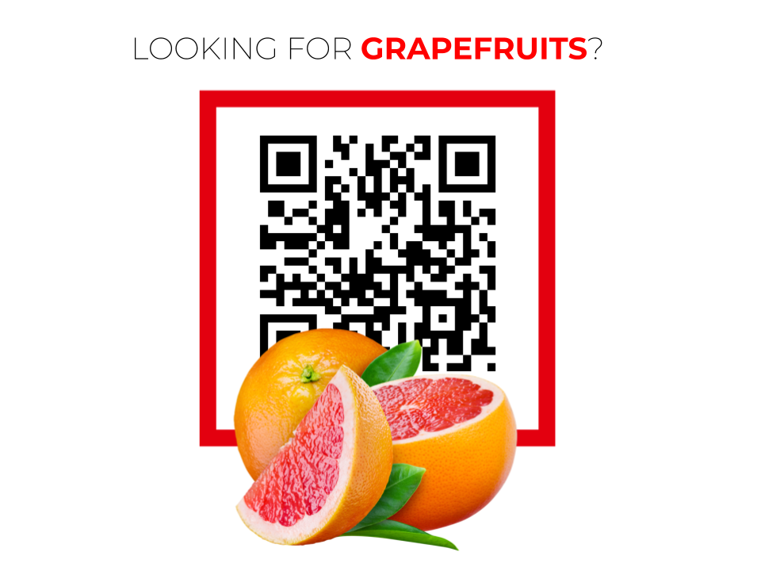

# easy-way

Finding your way through the supermarket - the easy way. 🤙

## Features

The project provides two features:

* We can calculate the shortest path between any two items, using the [A* search algorithm](https://en.wikipedia.org/wiki/A*_search_algorithm).
* We can calculate the shortest tour from entrance to checkout that passes all items on your shopping list, using the [Concorde TSP solver](http://www.math.uwaterloo.ca/tsp/concorde.html).

The features are exposed through an [OpenAPI v3](https://swagger.io/specification/) API and made available in a [Docker](https://www.docker.com/) container.

## App

For end-users, we also developed an Android app. You can see a work in progress version here:

## In-Shop Localization

There exist [many approaches for indoor positioning](https://en.wikipedia.org/wiki/Indoor_positioning_system#Wireless_technologies), mostly using wireless technologies like Wi-Fi and Bluetooth. However, all approaches come with an expensive setup, that involves purchasing expensive hardware and hiring qualified staff to perform the roll-out. This makes existing systems unfeasible for a project, that would invovle tenthousands of stores.

Instead, our approach requires no hardware and is easy to roll out: QR codes! We position QR at critical locations inside the store, each containing information about its location. The QR code could be positioned on a poster, explaining how to use this new feature.

## Algorithms

As part of this hackathon, we developed the [nx-concorde](https://github.com/janjagusch/nx-concorde) package, a Python package for solving the Travelling Salesperson Problem (TSP) for graphs. We found it very useful, so we decided to make it open source.

## Documentation

For more information about the API microservice, check the [API README](./api/README.md).

## Acknowledgement

This project was put together over the course of a weekend during the [Hackdays Baden-Württemberg](https://www.hack-days.de/baden-wuerttemberg) hackathon. Our team consisted of:

* [Hossam Waziry](https://www.linkedin.com/in/7ossam-gamal/)(Android Developer)
* [Kiran Vasudev](https://www.linkedin.com/in/kiranvasudev/)(Data Scientist)
* [Jan-Benedikt Jagusch](https://www.linkedin.com/in/janjagusch/)(Data Scientist)

## Licensing

See [LICENSE](LICENSE) for details. Please note that the underlying Concorde TSP solver is only available for academic research use. For other uses, contact [William Cook](bico@uwaterloo.ca) for licensing options.
